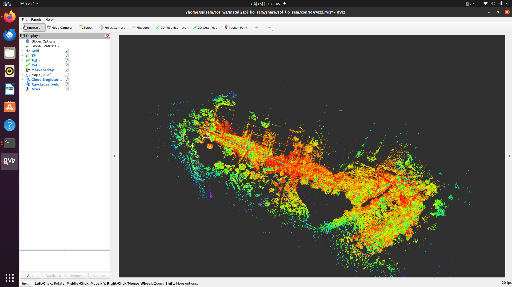

## 运行环境搭建

本项目提供基于`ROS2-humble`的镜像，并提供脚本可直接在镜像中启动可视化程序

### 数据

转为rosbag2格式的数据包 链接：https://pan.baidu.com/s/1hhHvn96uEsDYJNss3Z209Q 提取码：2478

```bash
export DATA_DIR=/path/to/Simple-LIO-SAM/park_dataset
```

### 环境部署
```bash
git clone git@github.com:zeal-up/Simple-LIO-SAM.git
cd Simple-LIO-SAM
./docker_run.sh -h  # show help message
./docker_run.sh -c /path/to/code/repo -d $DATA_DIR

# ./docker_into.sh  # enter the container next time
```

### 编译
```bash
cd Simple-LIO-SAM
./docker_into.sh

# 下面命令在镜像中执行
cd ~/ros_ws/
mkdir src && cd src &&ln -s /home/splsam/codes ./
cd ..
source /opt/ros/humble/setup.bash
colcon build --packages-select spl_lio_sam
```

### 运行
```bash
# docker镜像下运行
cd ~/ros_ws
source ./install/setup.bash
ros2 launch spl_lio_sam run.launch.py 

# 新开终端
cd Simple-LIO-SAM
./docker_into.sh
ros2 bag play ./path/to/Simple-LIO-SAM/park_dataset/ --topics /points_raw /imu_raw

```
运行时画面：



## Reference
1. [LIO-SAM](https://github.com/TixiaoShan/LIO-SAM)
2. [LIO-SAM paper](https://arxiv.org/abs/2007.00258)
3. [This Project](https://github.com/zeal-up/Simple-LIO-SAM)
4. [LIO-SAM-note](https://github.com/chennuo0125-HIT/LIO-SAM-note)
5. [LIO-SAM-DetailedNote](https://github.com/smilefacehh/LIO-SAM-DetailedNote)


[TixiaoShan]:https://github.com/TixiaoShan "作者Github"
[LIOSAM]:https://arxiv.org/abs/2007.00258 "liosam论文"
[spl]:https://github.com/zeal-up/Simple-LIO-SAM "Simple LIO-SAM"
[LIO-SAM-note]:https://github.com/chennuo0125-HIT/LIO-SAM-note "LIO-SAM-note"
[LIO-SAM-DetailedNote]:https://github.com/smilefacehh/LIO-SAM-DetailedNote "LIO-SAM-DetailedNote"