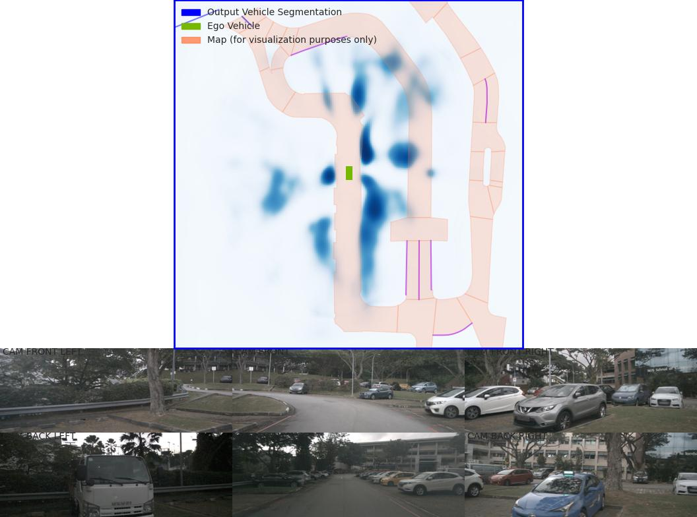
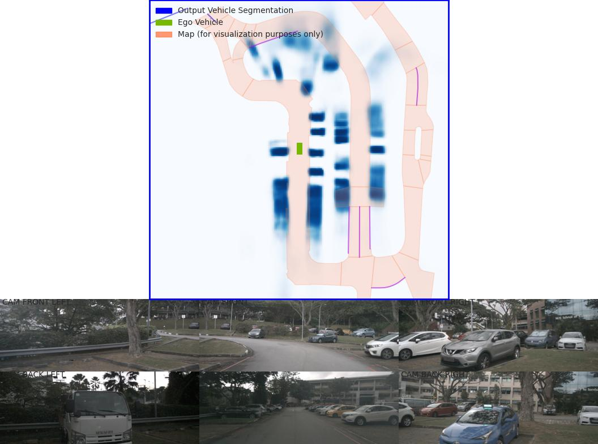

## 项目介绍
本项目基于 nv-tlabs/lift-splat-shoot（https://github.com/nv-tlabs/lift-splat-shoot） 实现
### 环境配备
1. 本文提供对应的镜像，执行拉取命令
```
docker pull crpi-z3us5iti0tbgc62p.cn-hangzhou.personal.cr.aliyuncs.com/vitaltech_nj_practice/lss_bev:v1.0
```
2. 进入容器
```
docker exec -it rtx3090_cuda_env /bin/bash
```
3. 激活环境
```
conda activate lssEnv
```
### 数据集下载

```
1、nuScenes数据集下载[https://www.nuscenes.org/](https://www.nuscenes.org/).
2、nuScenes数据集格式调整参考
      根目录下数据管道部分
      CSDN：https://blog.csdn.net/zyw2002/article/details/128319169
```
### 自定义数据集制备
```
参考根目录下 nuScenes数据集结构解析及自定义数据集操作.md
```
### 预训练模型

根目录下提供预训练模型 model525000.pt（LSS作者训练出来的模型）

### 评估模型
评估模型Loss与IOU
```
在容器中执行
python main.py eval_model_iou mini/trainval --modelf=MODEL_LOCATION --dataroot=NUSCENES_ROOT
```
### 可视化预测
```
在容器中执行
python main.py viz_model_preds mini/trainval --modelf=MODEL_LOCATION --dataroot=NUSCENES_ROOT --map_folder=NUSCENES_MAP_ROOT
```
### 可视化输入、输出
```
在容器中执行
python main.py lidar_check mini/trainval --dataroot=NUSCENES_ROOT --viz_train=False
```
### 训练模型
```
在容器中执行下面步骤
终端一：
python main.py train mini/trainval --dataroot=NUSCENES_ROOT --logdir=./runs --gpuid=0

终端二：
tensorboard --logdir=./runs --bind_all
或者
```
### 调参步骤
```
1. 根据tensorboard曲线以及过程中输出的loss及iou参数（可在train.py中设置发布频率）

2. 调整train.py中的学习率、正项权重、图像增强参数、训练次数等
```
### 训练效果参考
```
1. 下面将展示使用nuScenes的mini数据集的训练效果与LSS作者训练出来的效果对比

2. 建议后续使用完整数据集训练，直接使用LSS的作者的train.py大概需要几天的训练时间
```


