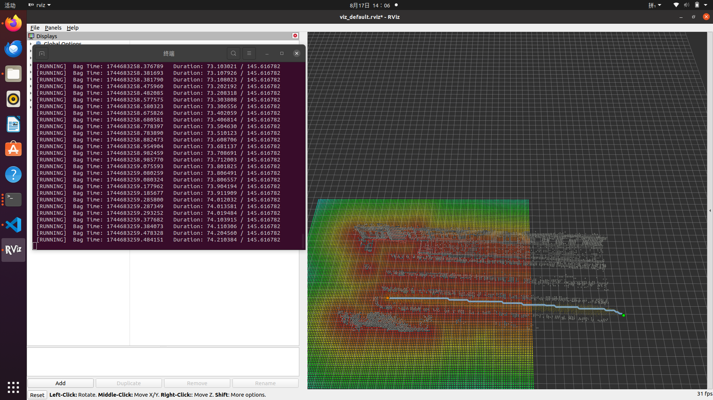

## 概述
    1. 使用rosbag+ROG-MAP建图
    2. 实现根据里程计的实时位置实现行内两个标定点之间的A*路径规划
## 运行环境搭建

```bash
# install dependencies
sudo apt-get install ros-noetic-rosfmt
# for MARSIM example
sudo apt-get install libglfw3-dev libglew-dev
# Eigen [version testd: 3.3.7-2] and soft link 
sudo apt-get install libeigen3-dev       
sudo ln -s /usr/include/eigen3/Eigen /usr/include/Eigen
# dw for backward cpp
sudo apt-get install libdw-dev

mkdir -p rog_ws/src && cd rog_ws/src
git clone https://github.com/hku-mars/ROG-Map.git
cd ..
catkin_make -DBUILD_TYPE=Release
```

## 应用

### 1. Running with MARSIM

First, launch the MARSIM environment:

```bash
source devel/setup.bash # or source devel/setup.zsh
roslaunch test_interface single_drone_os128.launch
```

Then, launch the ROG-Map test node and the keyboard controller:

```bash
sudo chmod +x -R src
roslaunch rog_map_example marsim_example.launch
```

#### Control the drone with keyboard


Use `W` `A` `S` `D` on your keyboard to control the drone's velocity, press the spacebar to stop, and press `Q` orh 2 2 2 `Ctrl + C` to exit.

### 2 Running A* Search Example

```bash
步骤一：
1、使用bag包构建地图
注意：需修改config文件里面的信息加载PCD选择false
终端1：
source devel/setup.bash # or source devel/setup.zsh
roslaunch rog_map_example astar_example.launch 
终端2：播放bag包
终端3：根据包内信息进行相关坐标转换，本仓库中提供对应转为camera_init坐标系的转换脚本，需与包同时运行
2、使用PCD文件转换栅格地图
适配性修改：
需要在launch文件中修改PCD路径参数
终端1：
source devel/setup.bash # or source devel/setup.zsh
roslaunch rog_map_example astar_example.launch 
```
```bash
步骤二：
在astar_example.yaml文件中修改对应标定点参数实现自定义路径规划
```
运行时画面：

### 注意
1. 若欲实现在Z轴近乎一个高度附近进行路径规划，避免出现从障碍物上方或者是下方穿过的现象（通过将起点和终点Z轴保持一致，此时Z轴搜索范围是【Z-步长，Z+步长】
2. Then, you can press `G` to enable `3D Nav Goal` in RViz and click to select a point. Each time you select two points, ROG-Map will perform path planning between them.


### 3 Run RRT* example

```bash
source devel/setup.bash # or source devel/setup.zsh
roslaunch rog_map_example rrt_example.launch 
```


## Acknowledgements

Special thanks to [ZJU-FAST-Lab](https://github.com/ZJU-FAST-Lab) and [HKUST Aerial Robotics Group](https://github.com/HKUST-Aerial-Robotics) for their great works.

* The MARSIM is modified from [MARSIM](https://github.com/hku-mars/MARSIM)

- The RRT* example was adapted from [ZJU-FAST-Lab's sampling-based path finding](https://github.com/ZJU-FAST-Lab/sampling-based-path-finding).
- Parts of ROG-Map and the A* example were inspired by [Ego-Planner](https://github.com/ZJU-FAST-Lab/ego-planner).
- The ESDF module was modified from [Fast-Planner](https://github.com/HKUST-Aerial-Robotics/Fast-Planner), with the addition of local map sliding functionality.
